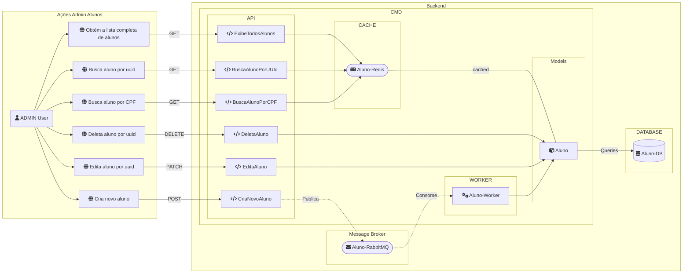
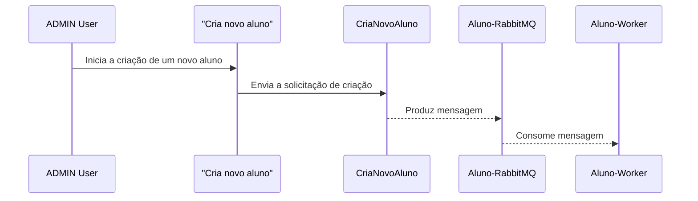
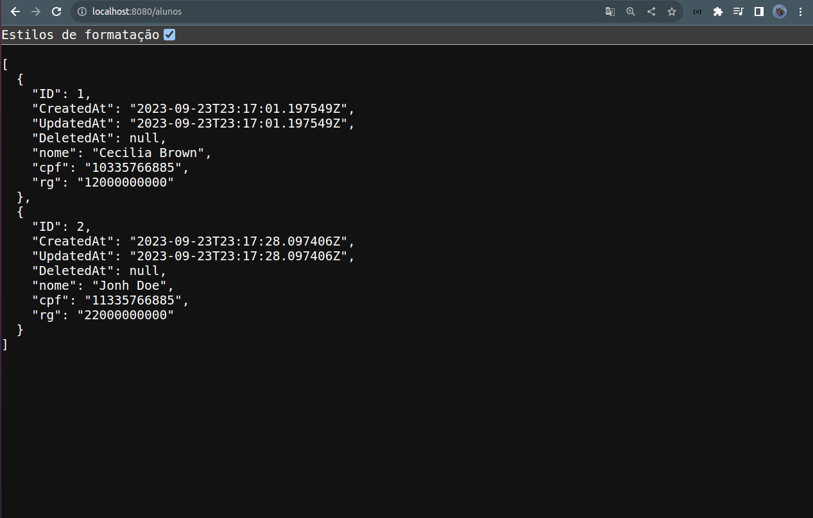
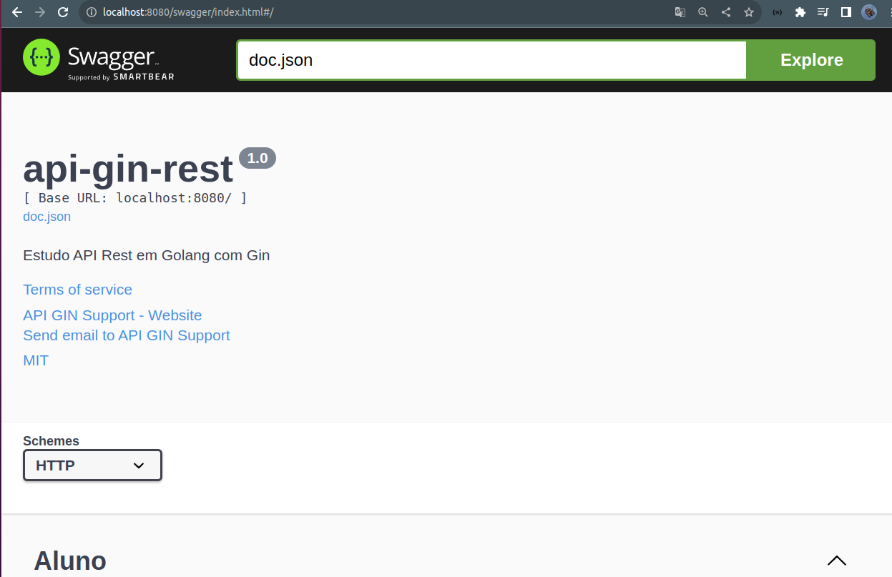
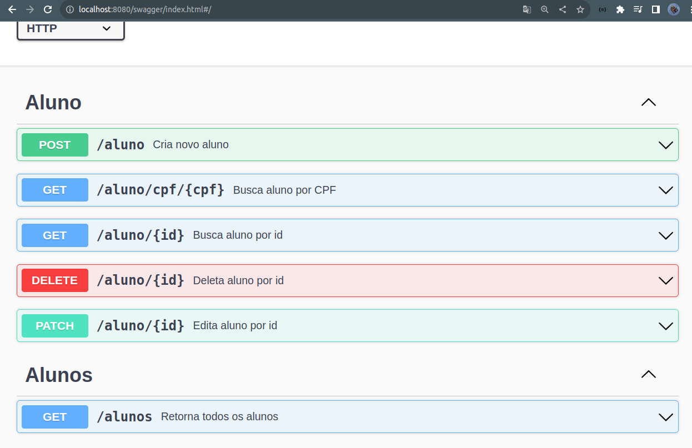
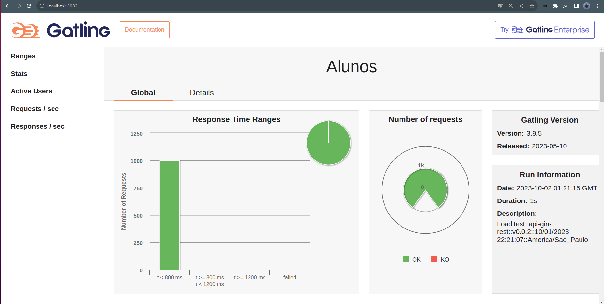
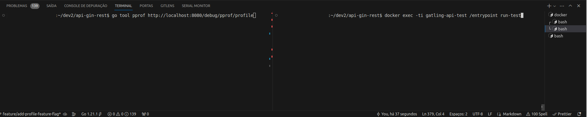
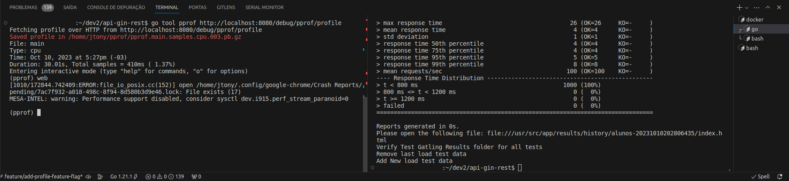
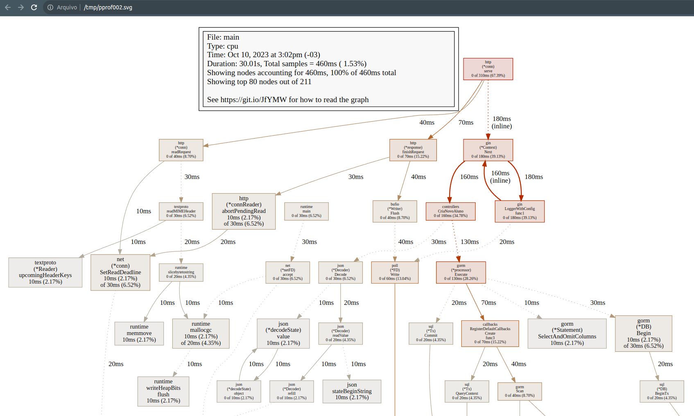

# Estudo API Rest em Golang com Gin
<link rel="stylesheet" href="https://use.fontawesome.com/releases/v5.3.1/css/all.css" crossorigin="anonymous">
<!-- 
https://fontawesome.com/search
https://stackoverflow.com/questions/60000125/fontawesome-on-github-flavored-markdown 
-->

<br> 


[          ](#estudo-de-autenticação-testes-e-segurança-em-nodejs)
<!--    -->

<!-- icons by: https://simpleicons.org/?q=types -->
<!-- markdown emojis: https://gist.github.com/rxaviers/7360908 -->


---

<a id="indice"></a>
## :arrow_heading_up: Índice

<!--ts-->
- [Go: Go e Gin: criando API rest com simplicidade](#estudo-api-rest-em-golang-com-gin)<br/>
  :arrow_heading_up: [Índice](#arrow_heading_up-índice)<br/>
  :green_book: [Sobre](#green_book-sobre)<br/>
  :computer: [Rodando o Projeto](#computer-rodando-o-projeto)<br/>
  :bar_chart: [Diagramas](#bar_chart-diagramas)<br/>
  :newspaper: [Gerando documentação com swagger](#newspaper-gerando-documentação-com-swagger)<br/>
  :camera: [Imagens do Projeto](#camera-imagens-do-projeto)<br/>
  :train: [Teste de Carga](#train-teste-de-carga)<br>
  :mag: [Profilling](#mag-profilling)<br/>
  :hammer: [Ferramentas](#hammer-ferramentas)<br/>
  :clap: [Boas Práticas](#clap-boas-práticas)<br/>
  :1234: [Versões](#1234-versões)<br/>

  <!--:female_detective: [Debugging](#female_detective-debugging)<br/>-->

<!--te-->
---
<a id="sobre"></a>
## :green_book: Sobre
Este projeto visa aprimorar a `API` de **Alunos** do curso [Go e Gin: criando API rest com simplicidade](https://www.alura.com.br/curso-online-go-gin-api-rest-simplicidade) de forma estritamente educativa. Continuo incorporando padrões e melhorias para estudar aplicações práticas.

Não considero colisões nos números de `CPF` e `RG`, pois o objetivo é criar uma API que lide com alta carga de inserções no momento, simulando um **game day** (dia de uso intenso em condições adversas)

Para alcançar essas melhorias, adotei as seguintes medidas que não estavam presentes no curso original:
- Técnicas de debbuging
- [Teste de carga com Gatling](#train-teste-de-carga)
- Técnicas de `Caching` usando `redis`
- Técnica de `Fila` com `messageBroker` para criacao de aluno usando `RabbitMQ`
- POC de [Escalabilidade Horizontal](#escalando-workers) nos workers
- Feature Flag para acionar `caching` e `messageBroker`
- [Profiling da aplicação](#mag-profilling) para identificar os pontos de "stress".
  - Profiling acionados por feature flag
  - Profiling em middleware


O projeto foi desenvolvido no SO Ubuntu e testado tanto no Ubuntu quanto no Windows, informações de desenvolvimento estão voltadas para o sistema operacional Linux.


[:arrow_heading_up: voltar](#indice)

---

### :computer: Rodando o Projeto

Crie uma cópia do arquivo `sample.env` com o nome `.env` e rode o comando `docker compose up` (de acordo com sua versão do `docker compose`) no diretorio raiz do projeto:
```bash
$ docker compose up
```

> :writing_hand: **Observação**:
>
> :window: Troubleshooting com [Windows](https://stackoverflow.com/questions/53165471/building-docker-images-on-windows-entrypoint-script-no-such-file-or-directory)
> Configurações de atributos do Git que podem afetar o caractere de fim de linha não estão funcionando como esperado. Portanto, para executar o projeto no Windows, será necessário fazer a alteração no arquivo `./tests/gatling/entrypoint.sh`. Converta o arquivos de `LF` para `CRLF` no seu editor de texto de preferência.


Aguarde até que as imagens sejam criadas e acesse:
#### Rotas REST:
- `http://localhost:8080/alunos` Rota para **API** 
- `http://localhost:8080/aluno/{uuid}` Rota para **API**
- `http://localhost:8080/aluno/cpf/{cpf}` Rota para **API**
- etc... *

*_maiores detalhes de rotas em: [swagger](#rotas-de-uso-de-desenvolvimento)_
<br/>

#### Rotas de uso de infra/suporte:
- `http://localhost:8080/readiness` Rota de **readiness**
- `http://localhost:8080/liveness` Rota de **liveness**
- `http://localhost:15672` Rota de **RabbitMQ** (verificar `.env` para senha)
<br/>

#### Rotas de uso de desenvolvimento:
- `http://localhost:8080/swagger/index.html` Rota para **documentação Swagger**
- `http://localhost:8082` Rota para **ultimo resultado de teste de carga**
- `http://localhost:8080/debug/pprof` Rota de **Profiling, disponível apenas caso** `PPROF_FEATURE_FLAG_ENABLED=1`. Consulte [Profiling](#mag-profilling) para maiores informações.


<br/>

#### Feature Flags:

:triangular_flag_on_post: Flag | :heavy_check_mark: Efeito quando ligada
-----|--------
PPROF_CPU_FEATURE_FLAG_ENABLED | Habilita rota de `Profiling` direto na controller
CACHE_FEATURE_FLAG_ENABLED | Habilita estratégia de `cache` em `redis` para as rotas via `middleware`
POST_ALUNO_AS_MESSAGE_FEATURE_FLAG_ENABLED | Rota de criação de aluno publica mensagens via `middleware` para `workers` consumirem ao invés de criar direto no DB

<br>

#### Escalando Workers:
A feature flag `POST_ALUNO_AS_MESSAGE_FEATURE_FLAG_ENABLED` quando acionada faz o sistema enviar mensagens de criação de alunos para o RabbitMQ na rota `POST aluno`. No arquivo `docker-compose.yml`. Você pode ajustar a [quantidade de réplicas](https://stackoverflow.com/questions/63408708/how-to-scale-from-within-docker-compose-file) do worker, que começa com `1`, para aumentar a capacidade de inserção de dados no banco de dados. Para que essa abordagem surta efeito comente a linha `container_name: worker-gin` e `hostname: worker-gin`. Nomear containers conflita com a funcionalidade `replicas` do docker

```docker-compose
101    worker-gin:
102        deploy:
103          replicas: 1
104 #      container_name: worker-gin
105 #      hostname: worker-gin
```
<!-- aplicar: https://www.rabbitmq.com/dlx.html -->

<br/>

#### Recomendações para Devs:
Embora seja desnecessária a instalação local de nada além do Docker para levantar o projeto, pode haver a necessidade de desenvolver/debbugar localmente.

Recomendo a instalação do [GVM](https://github.com/moovweb/gvm) para controle de versões da linguagem

Recomendo a instalação da extensão [Golang do VsCode](https://marketplace.visualstudio.com/items?itemName=golang.go)


[:arrow_heading_up: voltar](#indice)

---

 ### :bar_chart: Diagramas

<br/>

**Fluxo do Serviço Alunos:**



<br/>

**Sequência de criação de aluno:**



<br/>

[:arrow_heading_up: voltar](#indice)

---

### :newspaper: Gerando documentação com swagger

Como a imagem `api-gin-rest` rodando, digite:

```bash
$ docker exec -ti api-gin-rest swag init --parseDependency --parseInternal  --generalInfo cmd/api/main.go
```

Para os desenvolvedores que irão manipular o código ou se inspirar para seus próprios desenvolvimentos, há uma particularidade na documentação Swagger. O comando padrão do [swaggo/gin-swagger](https://github.com/swaggo/gin-swagger) (uma ferramenta que gera documentação Swagger para Go) não consegue ler `structs` que utilizam `gorm.Model`, e isso não está explicitamente mencionado em sua documentação. Pesquisando por uma solução, [encontrei o comando apropriado](https://github.com/swaggo/swag/issues/810) para a geração.


[:arrow_heading_up: voltar](#indice)

---


### :camera: Imagens do Projeto

<details>
  <summary>API</summary>
    
</details>
<br>
<details>
  <summary>Swagger 1</summary>
    
</details>
<br>
<details>
  <summary>Swagger 2</summary>
  
</details>
<br>
<details>
  <summary>Teste de Carga Gatling</summary>
    
    <i>*Teste Inicial, ainda estamos melhorando a API para performar volumes mais elevados de requests em proximas PR`s</i>
</details>
<br>


[:arrow_heading_up: voltar](#indice)

---


### :train: Teste de Carga

Com o projeto instalado e em execução após o comando `docker compose up`, acesse a rota que renderiza o resultado do teste mais recente em `http://localhost:8082`. Caso você tenha acabado de iniciar o ambiente, nenhum teste terá ocorrido até o momento. Em um novo terminal e, estando na raiz do projeto, execute o comando:


```bash
docker exec -ti gatling-api-test /entrypoint run-test
``` 
Aguarde alguns segundos para o aquecimento dos testes (que inclui o download de dependências, caso não existam, e a execução dos próprios testes). Assim que os testes forem concluídos, o endpoint `http://localhost:8082` apresentará os resultados.

Toda vez que desejar executar os testes novamente, basta rodar o comando a seguir: `docker exec -ti gatling-api-test /entrypoint run-test`.

Estrutura da pasta de testes do Gatling:
```shell
  $ tree
  api-gin-rest
  └── tests
  |    └── gatling
  |        ├── bundle # Binários e arquivos instalados do Gatling
  |        |   ├── .keep
  |        |   └── ... # Diretórios e arquivos gatling instalados após primeiro teste
  |        ├── results # Resultados dos testes
  |        |   ├── history # Histórico com todos os testes já performados e a pagina default
  |        |   |   ├── default # Dados de teste padrão, exibidos quando nenhum teste ainda foi performado
  |        |   |   └── ... # Diretórios de testes já performados
  |        |   └── latest # Arquivos do último teste performado
  |        |       ├── .keep
  |        |       └── ... # Diretórios e arquivos do resultado mais recente
  |        ├── user-files
  |        |   ├── resources # Arquivos de recursos utilizados nos testes: tsv, etc...
  |        |   |   └── api-gin-rest 
  |        |   |       └── alunos.tsv # Arquivo de dados de post paylod de alunos
  |        |   └── simulations # Pasta dos roteiros de testes, simulações
  |        |       └── api-gin-rest
  |        |           └── AlunosSimulation.scala # Roteiro de testes em scala
  |        ├── Dockerfile
  |        └── entrypoin.sh # As automações do Gatling estão aqui.
  |
  $ tree
  .
```


Usamos uma imagem com o **Gatling** instalado para performar testes de carga de maneira automatizada.
A imagem responsável por fornecer essa saída também é responsável por processar o teste.

<br/>

#### Limpando a instalação do Gatling e removendo históricos de testes:
 Importante: Isso não limpa as inserções feitas no banco de dados.
```shell
docker exec -ti gatling-api-test /entrypoint clean-test
```

<br/>

#### Limpando o Banco de Dados:
 Isso limpa as inserções feitas no banco de dados.
```shell
docker exec -ti gatling-api-test /entrypoint clean-db
```

<br/>

#### Configurando o Teste
Caso deseje alterar as configurações padrão do teste, modifique o arquivo `tests/gatling/user-files/simulations/AlunosSimulation.scala`. O método `setUp` lhe proporciona flexibilidade na criação de cenários de simulação.
```kotlin
  setUp(
    testAlunos.inject(rampUsers(1000).during(20.seconds))
  ).protocols(httpProtocol)
```

<br>

#### Debbuging do Gatling:
Visualização de logs de requisições do Gatling (apenas em ambiente local para fins de depuração):

Após a instalação do Gatling, que ocorre na primeira vez que você solicita a execução de um teste, vá até o arquivo `api-gin-rest/tests/gatling/bundle/conf/logback.xml` e descomente a linha `13`.
```xml
11  	<!-- uncomment and set to DEBUG to log all failing HTTP requests -->
12  	<!-- uncomment and set to TRACE to log all HTTP requests -->
13  	<logger name="io.gatling.http.engine.response" level="TRACE" />
``` 

<!-- https://worldline.github.io/gatling-cheatsheet/#feeders -->
[:arrow_heading_up: voltar](#indice)

---


<!-- ### :female_detective: Debugging


<br/>

[:arrow_heading_up: voltar](#indice)

---
-->

### :mag: Profilling

#### API:

O profiling da aplicação para fins de testes e validação está vinculado às rotas. O processo não é executado de maneira dockerizada, necessitando ter o [Go](#recomendações-para-devs) e o Graphviz instalados na sua máquina.

```shell
$ sudo apt-get install graphviz
```

Para ativar o profiling de rotas, basta alterar o valor da variável de ambiente `PPROF_FEATURE_FLAG_ENABLED` para `1` no arquivo `.env`:


```shell
PPROF_FEATURE_FLAG_ENABLED=1
```

Com isso, a seguinte rota fica ativa e apresenta resultados dos profiles disponíveis:

 ```shell
 http://localhost:8080/debug/pprof
 ```

Podemos agora, com `Go` e `Graphviz` na máquina hospedeira, ligar a coleta de métricas. Observe a imagem com dois terminais, no terminal 1 foi inserido o comando:
```shell
$ go tool pprof http://localhost:8080/debug/pprof/profile
```
Isso fará com que, durante os próximos trinta segundos, as requests feitas na API gerem massa de dados para o profiler. 



Assim que o comando `go tool pprof` for iniciado, em outro terminal ja tenha o comando do [Teste de Carga](#train-teste-de-carga) preparado para rodar e gerar insumos para o pprof. Comando no terminal 2:

```shell
$ docker exec -ti gatling-api-test /entrypoint run-test
```

<br/>

Após o [Teste de Carga](#train-teste-de-carga) rodar sua saida sera similar a seguinte:


No terminal do `pprof` o cursor deve estar aguardando o proximo comando para continuar o profiling, digite `web` no cursor e de `enter`, aguarde seu navegador o exibir a árvore de processamento de sua aplicação.
```bash
Fetching profile over HTTP from http://localhost:8080/debug/pprof/profile
Saved profile in /home/jtony/pprof/pprof.main.samples.cpu.003.pb.gz
File: main
Type: cpu
Time: Oct 10, 2023 at 5:27pm (-03)
Duration: 30.01s, Total samples = 410ms ( 1.37%)
Entering interactive mode (type "help" for commands, "o" for options)
(pprof) web
```

<br/>

A saida deve ser similar a:


*Bibliografia: [Profiling gin with pprof](https://dizzy.zone/2018/08/23/Profiling-gin-with-pprof/)*
<!--
https://github.com/gin-contrib/pprof
https://github.com/gin-contrib/pprof/blob/v1.4.0/_example/custom/server.go
https://github.com/gin-contrib/pprof/blob/v1.4.0/_example/default/server.go
 -->
<br/>

[:arrow_heading_up: voltar](#indice)

---

<a id="ferramentas"></a>
## :hammer: Ferramentas
As seguintes ferramentas foram usadas na construção do projeto:

- Linguagem:
  - [Go v1.21.1](https://go.dev/)
  - [GVM v1.0.22](https://github.com/moovweb/gvm)

- Framework & Libs:
  - [Gin](https://gin-gonic.com/)
  - [GORM](https://gorm.io/index.html)
  - [Viper](https://github.com/spf13/viper)
  - [Gin-Swagger](https://github.com/swaggo/gin-swagger)
  - [gin-contrib/pprof](https://github.com/gin-contrib/pprof)
  - [Exponential Backoff](https://github.com/cenkalti/backoff)
  - [go-redis](https://github.com/redis/go-redis)
  - [amqp091-go](https://github.com/rabbitmq/amqp091-go)
  - [gjson](https://github.com/tidwall/gjson)
  - [uuid](github.com/google/uuid)

- Infra & Tecnologias
  - [Docker v24.0.6](https://www.docker.com/)
  - [Docker compose v2.21.0](https://www.docker.com/)
  - [Postgres v16.0](https://www.postgresql.org/)
  - [Redis 6.2](https://redis.io/)
  - [RabbitMQ v3.12.6](https://www.rabbitmq.com/)
  - [Gatling v3.9.5](https://gatling.io/)


- GUIs:
  - [VsCode](https://code.visualstudio.com/)
  - [DBeaver](https://dbeaver.io/)
  - [another-redis-desktop-manager](https://github.com/qishibo/AnotherRedisDesktopManager)


[:arrow_heading_up: voltar](#indice)

---


<a id="boas-praticas"></a>
## :clap: Boas Práticas
Seguindo boas práticas de desenvolvimento:
- [Conventional Commits](https://www.conventionalcommits.org/en/v1.0.0/)
- [keep a changelog](https://keepachangelog.com/en/1.0.0/)
- [Mermaid Diagrams](https://mermaid.js.org)
- [Swagger](https://swagger.io/)
- [Load testing](https://en.wikipedia.org/wiki/Load_testing)
- [Go pprof](https://go.dev/blog/pprof)

[:arrow_heading_up: voltar](#indice)

---

<a id="versionamento"></a>
## :1234: Versões
As tags de versões estao sendo criadas manualmente a medida que os estudos avançam com melhorias notáveis no projeto. Cada funcionalidade é desenvolvida em uma branch a parte quando finalizadas é gerada tag e mergeadas em master.


Para obter mais informações, consulte o [Histórico de Versões](./CHANGELOG.md).

[:arrow_heading_up: voltar](#indice)

<!-- 
https://tutorialedge.net/golang/go-decorator-function-pattern-tutorial/
https://srinjoysantra.medium.com/decorator-pattern-in-golang-a831ecae0d38

Gifs para readme.md ricos
https://www.omgubuntu.co.uk/2017/02/peek-animated-gif-screen-capture-linux-update

Golang and Redis
https://voskan.host/2023/08/14/golang-redis-caching/

OpenTelemetry Redis
https://github.com/redis/go-redis/blob/master/example/otel/client.go

Clean Architecture Gin
https://github.com/wesionaryTEAM/go_clean_architecture
-->

