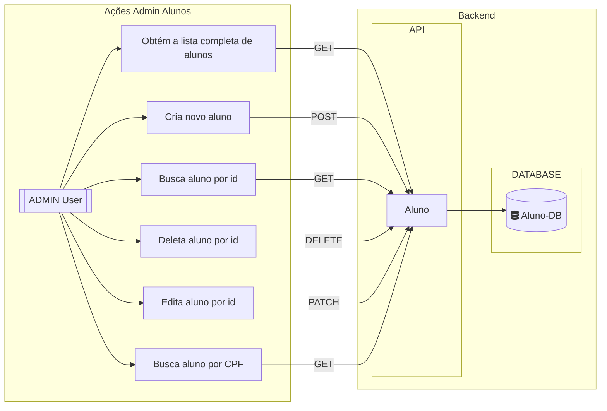

<link rel="stylesheet" href="https://use.fontawesome.com/releases/v5.3.1/css/all.css" crossorigin="anonymous">
# Estudo API Rest em Golang com Gin
<br> 


[       ](#estudo-de-autenticação-testes-e-segurança-em-nodejs) <!-- icons by https://simpleicons.org/?q=types -->
<!--    -->


---

<a id="indice"></a>
## :arrow_heading_up: Índice
<!--ts-->
- [Go: Go e Gin: criando API rest com simplicidade](#estudo-api-rest-em-golang-com-gin)<br/>
  :arrow_heading_up: [Índice](#arrow_heading_up-índice)<br/>
  :green_book: [Sobre](#green_book-sobre)<br/>
  :computer: [Rodando o Projeto](#computer-rodando-o-projeto)<br/>
  :newspaper: [Gerando documentação com swagger](#newspaper-gerando-documentação-com-swagger)<br/>
  :camera: [Imagens do Projeto](#camera-imagens-do-projeto)<br/>
  :bar_chart: [Diagramas](#bar_chart-diagramas)<br/>
  :train: [Teste de Carga](#train-teste-de-carga)<br>
  :hammer: [Ferramentas](#hammer-ferramentas)<br/>
  :clap: [Boas Práticas](#clap-boas-práticas)<br/>
  :1234: [Versões](#1234-versões)<br/>

<!--te-->
---
<a id="sobre"></a>
## :green_book: Sobre
Este projeto visa aprimorar o curso [Go e Gin: criando API rest com simplicidade](https://www.alura.com.br/curso-online-go-gin-api-rest-simplicidade) de forma estritamente educativa.

Após a conclusão do curso, continuo incorporando padrões de mercado e melhorias para estudar aplicações práticas. Minha inspiração vem da [Rinha de Backend](https://github.com/zanfranceschi/rinha-de-backend-2023-q3) e dos livros [Test-Driven Development in Go](https://www.amazon.com.br/Test-Driven-Development-practical-idiomatic-real-world/dp/1803247878/ref=sr_1_1), [Criando Microsserviços – 2ª Edição](https://www.amazon.com.br/gp/product/B09WF2MVT8/ref=dbs_a_def_rwt_bibl_vppi_i0) e [Microsserviços Prontos Para a Produção](https://www.amazon.com.br/Microsservi%C3%A7os-Prontos-Para-Produ%C3%A7%C3%A3o-Padronizados/dp/8575226215).

O objetivo é aprimorar o desempenho, corrigir questões identificadas e aplicar os conceitos aprendidos nos livros mencionados como parte do meu processo de estudo.


[:arrow_heading_up: voltar](#indice)

---

### :computer: Rodando o Projeto

Crie uma copia do arquivo `sample.env` com o nome `.env` e rode o comando docker-compose (de acordo com sua versão do `docker compose`) no diretorio raiz do projeto:
```bash
$ docker compose up
```

> :writing_hand: **Observação**:
>
> :window: Troubleshooting com [Windows](https://stackoverflow.com/questions/53165471/building-docker-images-on-windows-entrypoint-script-no-such-file-or-directory)
> Por algum motivo, as configurações de atributos do Git que podem afetar o caractere de fim de linha não estão funcionando como esperado, e ainda não identificamos o motivo. Portanto, para executar o projeto no Windows, será necessário fazer uma alteração manual no arquivo `./tests/gatling/entrypoint.sh`. Em vez disso, converta o arquivos de `LF` para `CRLF` no seu editor de texto de preferência.


Aguarde até que as imagens sejam criadas e acesse:

`http://localhost:8080/alunos` Rota para **API**<br/> 
<br/>

`http://localhost:8080/readiness` Rota de **readiness**<br/>
`http://localhost:8080/liveness` Rota de **liveness**<br/>
<br/>

`http://localhost:8080/swagger/index.html` Rota para **documentação Swagger**<br/>
`http://localhost:8082` Rota para **ultimo resultado de teste de carga**<br/>

<br>

#### Recomendações para Devs:
Embora seja desnecessária a instalação local de nada além do Docker para levantar o projeto, pode haver a necessidade de desenvolver localmente. As versões mais recentes da linguagem já têm a instalação simplificada pelo `snap`
```bash
$ sudo snap install go --classic
```

Recomendo a instalação do [GVM](https://github.com/moovweb/gvm) para controle de versões da linguagem

Recomendo a instalação da extensão [Golang do VsCode](https://marketplace.visualstudio.com/items?itemName=golang.go)


<!-- Descobrindo o host do banco postgres para configurar o pgadmin, apos subir o docker-compose:

bash
$ docker-compose exec postgres sh
# hostname -i

ou
bash
$ docker inspect container_id | grep IPAddress -->


[:arrow_heading_up: voltar](#indice)

---
### :newspaper: Gerando documentação com swagger

Como a imagem `api-gin-rest` rodando, digite:

```bash
$ docker exec -ti api-gin-rest swag init --parseDependency --parseInternal
```

Para os desenvolvedores que irão manipular o código ou se inspirar para seus próprios desenvolvimentos, há uma particularidade na documentação Swagger. O comando padrão do [swaggo/gin-swagger](https://github.com/swaggo/gin-swagger) (uma ferramenta que gera documentação Swagger para Go) não consegue ler `structs` que utilizam `gorm.Model`, e isso não está explicitamente mencionado em sua documentação. Pesquisando por uma solução, [encontrei o comando apropriado](https://github.com/swaggo/swag/issues/810) para a geração.


[:arrow_heading_up: voltar](#indice)

---


### :camera: Imagens do Projeto

<details>
  <summary>API</summary>
    
</details>
<br>
<details>
  <summary>Swagger 1</summary>
    
</details>
<br>
<details>
  <summary>Swagger 2</summary>
  
</details>
<br>
<details>
  <summary>Teste de Carga Gatling</summary>
    
    <i>*Teste Inicial, ainda estamos melhorando a API para performar volumes mais elevados de requests em proximas PR`s</i>
</details>
<br>

[:arrow_heading_up: voltar](#indice)

---

 ### :bar_chart: Diagramas



<br/>

[:arrow_heading_up: voltar](#indice)

---

### :train: Teste de Carga
Usamos uma imagem com o **Gatling** instalado para performar testes de carga de maneira automatizada.
Com o projeto instalado e em execução após o comando `docker compose up`, acesse a rota que renderiza o resultado do teste mais recente em `http://localhost:8082`. Caso você tenha acabado de iniciar o ambiente, nenhum teste terá ocorrido até o momento.

A imagem responsável por fornecer essa saída também é responsável por processar o teste. Para executar um novo teste, basta abrir um novo terminal e, estando na raiz do projeto, execute o comando:

```bash
docker exec -ti gatling-api-test /entrypoint run-test
``` 
Aguarde alguns segundos para o aquecimento dos testes (que inclui o download de dependências, caso não existam, e a execução dos próprios testes). Assim que os testes forem concluídos, o endpoint `http://localhost:8082` apresentará os resultados.

Toda vez que desejar executar os testes novamente, basta rodar o comando a seguir: `docker exec -ti gatling-api-test /entrypoint run-test`.

Estrutura da pasta de testes do Gatling:
```shell
  $ tree
  api-gin-rest
  └── tests
  |    └── gatling
  |        ├── bundle # Binários e arquivos instalados do Gatling
  |        |   ├── .keep
  |        |   └── ... # Diretórios e arquivos gatling instalados após primeiro teste
  |        ├── results # Resultados dos testes
  |        |   ├── history # Histórico com todos os testes já performados e a pagina default
  |        |   |   ├── default # Dados de teste padrão, exibidos quando nenhum teste ainda foi performado
  |        |   |   └── ... # Diretórios de testes já performados
  |        |   └── latest # Arquivos do último teste performado
  |        |       ├── .keep
  |        |       └── ... # Diretórios e arquivos do resultado mais recente
  |        ├── user-files
  |        |   ├── resources # Arquivos de recursos utilizados nos testes: tsv, etc...
  |        |   |   └── api-gin-rest 
  |        |   |       └── alunos.tsv # Arquivo de dados de post paylod de alunos
  |        |   └── simulations # Pasta dos roteiros de testes, simulações
  |        |       └── api-gin-rest
  |        |           └── AlunosSimulation.scala # Roteiro de testes em scala
  |        ├── Dockerfile
  |        └── entrypoin.sh # As automações do Gatling estão aqui.
  |
  $ tree
  .
```

<br/>

#### Limpando a instalação do Gatling e removendo históricos de testes:
 Importante: Isso não limpa as inserções feitas no banco de dados.
```shell
docker exec -ti gatling-api-test /entrypoint clean-test
```

<br/>

#### Debbuging do Gatling:
Visualização de logs de requisições do Gatling (apenas em ambiente local para fins de depuração):

Após a instalação do Gatling, que ocorre na primeira vez que você solicita a execução de um teste, vá até o arquivo `api-gin-rest/tests/gatling/bundle/conf/logback.xml` e descomente a linha `13`.
```xml
11  	<!-- uncomment and set to DEBUG to log all failing HTTP requests -->
12  	<!-- uncomment and set to TRACE to log all HTTP requests -->
13  	<logger name="io.gatling.http.engine.response" level="TRACE" />
``` 

<!-- https://worldline.github.io/gatling-cheatsheet/#feeders -->
[:arrow_heading_up: voltar](#indice)

---

<a id="ferramentas"></a>
## :hammer: Ferramentas
As seguintes ferramentas foram usadas na construção do projeto:

- [GVM v1.0.22](https://github.com/moovweb/gvm)
- [Go v1.21.1](https://go.dev/)
- [Gin](https://gin-gonic.com/)
- [GORM](https://gorm.io/index.html)
- [Viper](https://github.com/spf13/viper)
- [Gin-Swagger](https://github.com/swaggo/gin-swagger)
- [Postgres v16.0](https://www.postgresql.org/)
- [Docker v24.0.6](https://www.docker.com/)
- [Docker compose v2.21.0](https://www.docker.com/)
- [Gatling v3.9.5](https://gatling.io/)
- [VsCode](https://code.visualstudio.com/)
- [DBeaver](https://dbeaver.io/)


[:arrow_heading_up: voltar](#indice)

---


<a id="boas-praticas"></a>
## :clap: Boas Práticas
Seguindo boas práticas de desenvolvimento:
- [Conventional Commits](https://www.conventionalcommits.org/en/v1.0.0/)
- [keep a changelog](https://keepachangelog.com/en/1.0.0/)
- [Mermaid Diagrams](https://mermaid.js.org)
- [Swagger](https://swagger.io/)
- [Load testing](https://en.wikipedia.org/wiki/Load_testing)

[:arrow_heading_up: voltar](#indice)

---

<a id="versionamento"></a>
## :1234: Versões
As tags de versões estao sendo criadas manualmente a medida que os estudos avançam com melhorias notáveis no projeto. Cada funcionalidade é desenvolvida em uma branch a parte quando finalizadas é gerada tag e mergeadas em master.


Para obter mais informações, consulte o [Histórico de Versões](./CHANGELOG.md).

[:arrow_heading_up: voltar](#indice)
